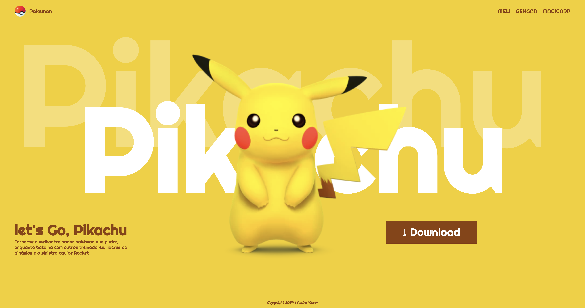

# Landing Page - Let's Go, Pikachu!

---
## Sobre

Site do Tipo Land Page, criado para divulgar o jogo "Let's Go Pikachu!". O intuito deste projeto é colocar em prática o conhecimento que doi adquirido sobre as linguagens de marcação, HTML, CSS e markDown, no curso Técnico de Desenvolvimento de Sistemas do [SENAI JANDIRA](https://sp.senai.br/unidade/jandira/).

## Tecnologias Utilizadas 

- HTML 
- CSS 
- MarkDown
- Git
---
# Autor 
- [Pedro Victor](https://www.linkedin.com/in/pedro-rodrigues-41169031b/).